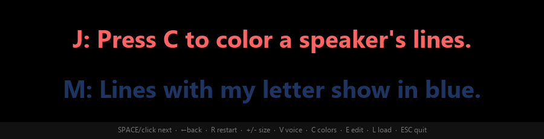

# Camera Teleprompter

A tiny, dependency-free teleprompter that parks right up against your webcam.
Built with Python's standard-library **Tkinter** — nothing to `pip install`.




It shows two lines at a time: the **current line bright on top**, the **next line
dimmed below**. Press **Space** to slide smoothly to the next line. The window is
borderless and always-on-top, so you can drag it so the text sits right next to
your lens and read while looking (almost) straight into the camera.

**Multiple readers, one PC:** open Settings (press **C**) and assign a color to a
starting letter. Every line that begins with that letter is shown in that color —
so two or more people can instantly spot their own lines. Write your script like:

```
J: My line goes here.
M: And my line goes here.
```

Your color choices are saved to `teleprompter_config.json` next to the script.

**Hands-free voice follow (optional):** press **V** and the app listens with your
mic and automatically advances to the next line the moment you finish reading the
current one — no clicking, no remote. It uses offline speech recognition
([Vosk](https://alphacephei.com/vosk/)), so nothing leaves your computer.

Voice follow is entirely optional — the core teleprompter needs no extra
packages. To enable it:

```sh
pip install -r requirements-voice.txt      # vosk + sounddevice
python tools/download_model.py             # fetches a ~40 MB English model -> ./model
```

Then run the app and press **V**. (You can also point at any Vosk model via the
`VOSK_MODEL` environment variable.) If the packages or model aren't present,
pressing **V** just shows a hint and everything else keeps working.

## Run

```sh
python teleprompter.py
```

Requires Python 3 (Tkinter ships with the standard CPython installer on Windows
and macOS; on Linux install `python3-tk`).

### Windows: no Python? Download the .exe

Grab `CameraTeleprompter.exe` from the
[latest release](https://github.com/EithanTuy/camera-teleprompter/releases/latest)
and double-click it — no install, no Python required.

> Note: the prebuilt `.exe` includes everything **except** voice follow (which
> needs the Vosk speech model). For hands-free voice follow, run from Python as
> described below.

### Build the .exe yourself

```sh
pip install pyinstaller
build.bat        # or: python -m PyInstaller --onefile --windowed --name CameraTeleprompter teleprompter.py
```

The executable lands in `dist\CameraTeleprompter.exe`.

## Controls

| Key / action        | What it does                          |
|---------------------|---------------------------------------|
| `Space` / click / `↓` `→` | Next line (smooth slide)        |
| `←` / `↑`           | Previous line                         |
| `R`                 | Restart from the top                  |
| `+` / `-`           | Bigger / smaller text                 |
| `V`                 | Voice follow: auto-advance when you finish a line |
| `C`                 | Settings: speaker letter → color      |
| `E`                 | Edit / paste your script in-window    |
| `L`                 | Load a `.txt` script file             |
| drag                | Move the window                       |
| `Esc`               | Quit (or exit edit mode)              |

## Your script

Three ways to set it:

- Press **E** and paste your text (one line per line), then **E** again to save.
- Press **L** to load a `.txt` file.
- Edit the `DEFAULT_SCRIPT` block near the top of `teleprompter.py`.

Each non-empty line becomes one teleprompter line.

## Tuning the slide

Near the top of `teleprompter.py`:

- `STEPS` — animation frames (more = smoother / slower)
- `INTERVAL` — milliseconds between frames

## License

[MIT](LICENSE)
